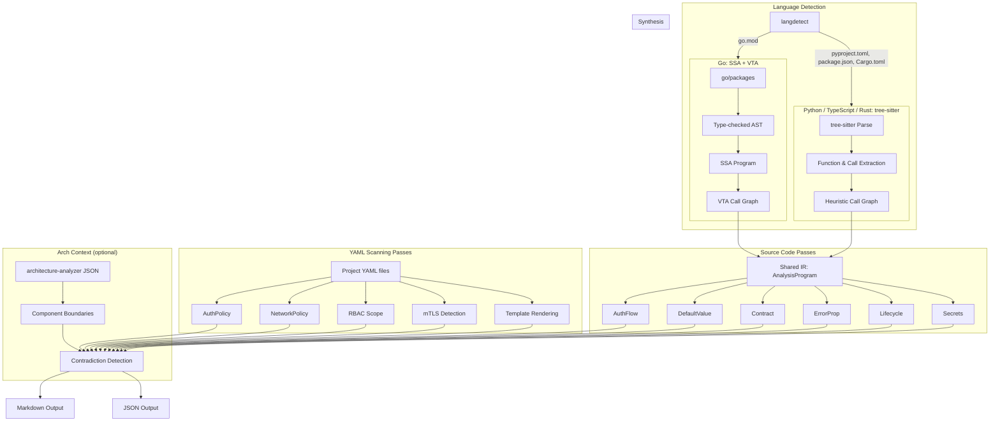
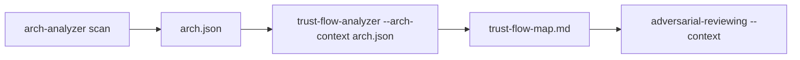

# Design Overview

## Core approach

trust-flow-analyzer operates at a different abstraction level from tools like CodeQL, Joern, or Semgrep. Those tools answer "does data flow from A to B?" trust-flow-analyzer answers "A assumes B validates the data, but B doesn't."

This is based on **assume-guarantee reasoning** from formal verification: components make assumptions about their environment, and invalid assumptions cause failures.

## Architecture

The tool operates in dual mode: SSA+VTA for Go projects (precise, interface-aware analysis) and tree-sitter for Python, TypeScript, and Rust projects (heuristic, name-based analysis). Both paths feed into the same intermediate representation consumed by all 11 passes.



### Architecture context data flow

When `--arch-context` is provided, the tool loads an architecture-analyzer JSON output file containing component definitions. This enriches the analysis:

1. **Component scoping**: findings are attributed to specific architectural components
2. **Cross-component detection**: contradictions that span component boundaries are flagged with the component names involved
3. **Boundary awareness**: the synthesis engine uses component boundaries to weight cross-component assumptions higher than intra-component ones



## Why SSA + VTA (Go)

- **SSA** (Static Single Assignment) decomposes code into a form where each variable is assigned exactly once, making data flow analysis precise
- **VTA** (Variable Type Analysis) resolves interface calls to concrete implementations, giving accurate call graphs for Go code with interfaces
- This is the same stack used by `govulncheck`, the official Go vulnerability scanner

## Why tree-sitter (Python, TypeScript, Rust)

- **Fast parsing**: tree-sitter provides incremental, error-tolerant parsing for all three languages
- **Consistent extraction**: the same extraction patterns (functions, call sites, decorators, error patterns) work across languages
- **Heuristic call graphs**: name-based resolution handles most direct function calls and method calls, covering the common case for security analysis

The trade-off: tree-sitter analysis misses indirect calls (callbacks, dynamic dispatch, computed names) that SSA+VTA handles precisely for Go.

## Dual-mode operation

The intermediate representation (`ir.AnalysisProgram`) abstracts over both backends:

```
ir.AnalysisProgram
├── Language     (go, python, typescript, rust)
├── ModulePath
├── RootDir
├── Functions    (extracted function info)
├── CallSites    (extracted call sites)
├── Callees      (call graph: caller -> callee)
├── Callers      (call graph: callee -> caller)
├── Files        (file path -> content)
├── GoSSA        (nil for non-Go)
│   ├── SSA
│   ├── Fset
│   ├── Packages
│   └── CallGraph
└── ErrorPatterns (tree-sitter extracted)
```

Passes check `Program.GoSSA != nil` to decide whether to use SSA-based or IR-based analysis. The six YAML-scanning passes (AuthPolicy, NetworkPolicy, RBAC, mTLS, Template, Secrets) operate directly on file content and work identically for all languages.

## Module scoping

Analysis is scoped to the target module only. Functions from the standard library and vendored dependencies appear in the call graph (needed for accurate reachability) but are excluded from findings. This prevents the output from being flooded with stdlib noise.

## Determinism

The output is deterministic: same input produces same output on every run. This is achieved by:

- Sorting all function lists by their SSA string representation (Go) or by file path + line (tree-sitter)
- Sorting findings by severity then title before assigning IDs
- Using BFS with deterministic queue ordering for call graph traversal
- No randomness or timestamp-dependent logic anywhere

## Package structure

```
pkg/
├── ir/          # Shared intermediate representation (AnalysisProgram)
├── langdetect/  # Project language detection
├── loader/      # Go: package loading, SSA, VTA call graph
├── treesitter/  # Python/TS/Rust: parsing, call graph construction
│   ├── parser.go
│   ├── callgraph.go
│   ├── python.go
│   ├── typescript.go
│   └── rust.go
├── platform/    # K8s platform knowledge database
├── passes/
│   ├── pass.go        # Pass interface and context
│   ├── authflow/      # Authentication/authorization flow detection
│   ├── defaults/      # Configuration default analysis + webhook + params.env
│   ├── contract/      # Function contract verification
│   ├── errorprop/     # Error propagation tracing
│   ├── lifecycle/     # K8s resource lifecycle tracking
│   ├── secrets/       # Secret exposure detection
│   ├── authpolicy/    # Auth policy YAML scanning
│   ├── netpolicy/     # NetworkPolicy YAML scanning
│   ├── rbacscope/     # RBAC ClusterRole/Binding scanning
│   ├── meshpolicy/    # Istio/OSSM mTLS policy scanning
│   └── template/      # Template rendering risk scanning
├── synthesis/   # Cross-pass contradiction detection (10 rules)
└── output/      # Markdown and JSON output generation
```

## Comparison with existing tools

| Tool | Approach | Languages | Limitation |
|------|----------|-----------|------------|
| CodeQL | Whole-program database, query language | Many | Requires compilation, no assumption extraction |
| Joern | Code property graph, Scala queries | Many | Low-level (AST+CFG+PDG), no component abstraction |
| Semgrep | Pattern matching, cross-file taint | Many | Can't reason about what empty config means |
| govulncheck | VTA call graphs for reachability | Go | Only checks if vulnerable code is reachable |
| Kubescape | K8s manifest scanning | YAML | No source code analysis, no cross-file synthesis |
| **trust-flow-analyzer** | SSA + VTA + tree-sitter + platform semantics | Go, Python, TS, Rust | Extracts what components assume about each other |
