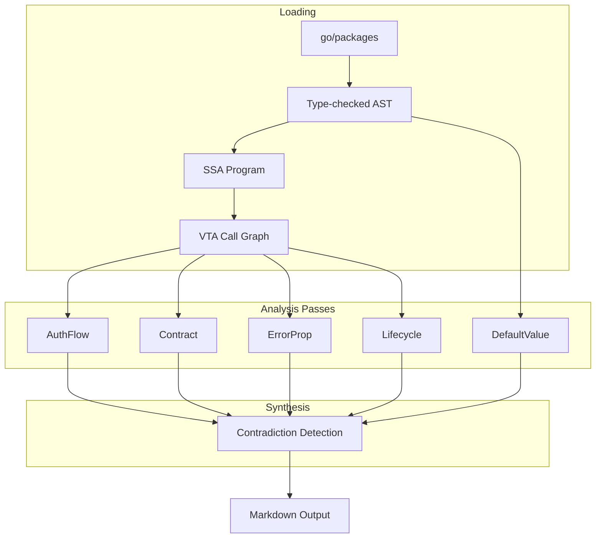

# Design Overview

## Core approach

trust-flow-analyzer operates at a different abstraction level from tools like CodeQL, Joern, or Semgrep. Those tools answer "does data flow from A to B?" trust-flow-analyzer answers "A assumes B validates the data, but B doesn't."

This is based on **assume-guarantee reasoning** from formal verification: components make assumptions about their environment, and invalid assumptions cause failures.

## Architecture



## Why SSA + VTA

- **SSA** (Static Single Assignment) decomposes code into a form where each variable is assigned exactly once, making data flow analysis precise
- **VTA** (Variable Type Analysis) resolves interface calls to concrete implementations, giving accurate call graphs for Go code with interfaces
- This is the same stack used by `govulncheck`, the official Go vulnerability scanner

## Module scoping

Analysis is scoped to the target module only. Functions from the standard library and vendored dependencies appear in the call graph (needed for accurate reachability) but are excluded from findings. This prevents the output from being flooded with stdlib noise.

## Determinism

The output is deterministic: same input produces same output on every run. This is achieved by:

- Sorting all function lists by their SSA string representation
- Sorting findings by severity then title before assigning IDs
- Using BFS with deterministic queue ordering for call graph traversal
- No randomness or timestamp-dependent logic anywhere

## Package structure

```
pkg/
├── types/       # Shared data structures
├── loader/      # Package loading, SSA, VTA call graph
├── platform/    # K8s platform knowledge database
├── passes/
│   ├── pass.go       # Pass interface
│   ├── authflow/     # Authentication/authorization flow detection
│   ├── defaults/     # Configuration default analysis
│   ├── contract/     # Function contract verification
│   ├── errorprop/    # Error propagation tracing
│   └── lifecycle/    # K8s resource lifecycle tracking
├── synthesis/   # Cross-pass contradiction detection
└── output/      # Markdown output generation
```

## Comparison with existing tools

| Tool | Approach | Limitation |
|------|----------|------------|
| CodeQL | Whole-program database, query language | Requires compilation, no assumption extraction |
| Joern | Code property graph, Scala queries | Low-level (AST+CFG+PDG), no component abstraction |
| Semgrep | Pattern matching, cross-file taint | Can't reason about what empty config means |
| govulncheck | VTA call graphs for reachability | Only checks if vulnerable code is reachable |
| **trust-flow-analyzer** | SSA + VTA + platform semantics | Extracts what components assume about each other |
