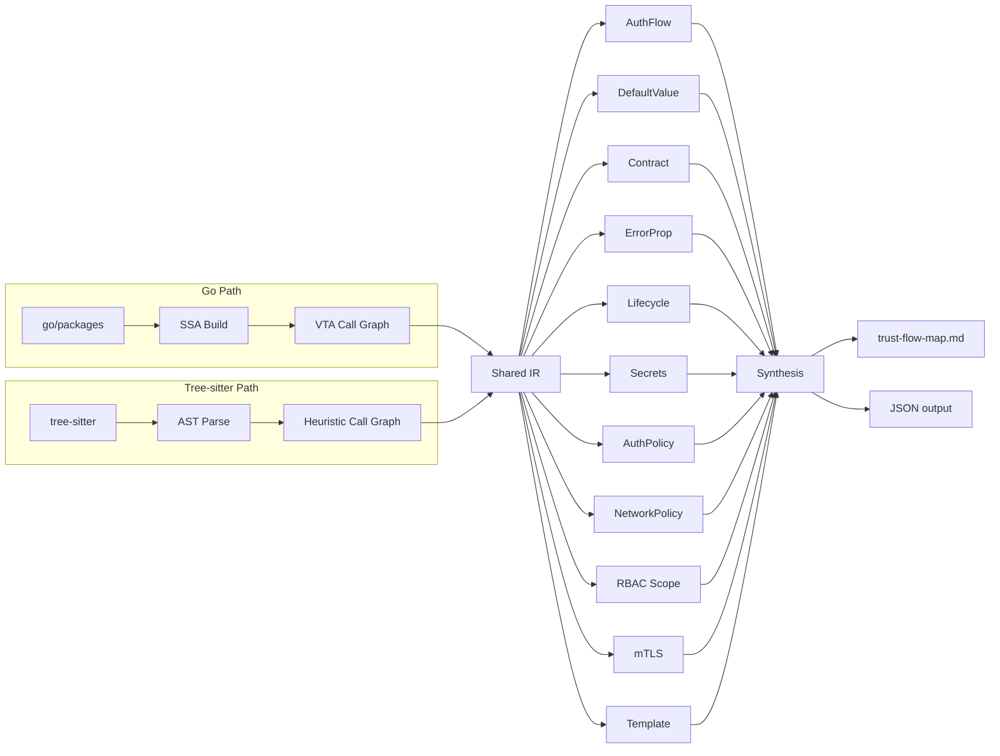

# trust-flow-analyzer

Deterministic cross-file trust flow extraction for Go, Python, TypeScript, and Rust source code. No LLM calls. Same output every run.

## What it does

Static analysis tools like CodeQL can tell you "data flows from A to B." trust-flow-analyzer tells you **"A assumes B validates the data, but B doesn't."**

It extracts cross-file implicit assumptions that contradict each other, a pattern known in formal verification as [assume-guarantee reasoning](https://en.wikipedia.org/wiki/Assume-guarantee_reasoning).

## The problem

LLM-based code review agents analyze files individually and miss cross-file compositional vulnerabilities. The agent finds the pieces but never synthesizes "the combination of these defaults across 5 files creates a bypass."

For example, in a real kube-auth-proxy review:

- `tokenreview.go`: empty audiences field (noted but dismissed as "documented behavior")
- `provider_default.go`: `len(AllowedGroups) == 0 { return true }` (noted but rated Minor)
- `authz/auth.go`: SubjectAccessReview exists (noted as mitigation)

The agent dismissed the first two because it saw the SAR in the third file. But the SAR is on a **different code path**. The agent confused which mitigation applies to which path because it doesn't maintain a structured map of parallel trust flows.

## Multi-language support

trust-flow-analyzer automatically detects the project language and selects the appropriate analysis backend.

| Language | Backend | Call Graph | Entry Points |
|----------|---------|------------|--------------|
| **Go** | SSA + VTA (`go/packages`) | Precise, interface-aware | `ServeHTTP`, webhooks, `Reconcile` |
| **Python** | tree-sitter | Heuristic name resolution | Flask/FastAPI routes, decorators |
| **TypeScript** | tree-sitter | Heuristic name resolution | Express handlers, Next.js routes |
| **Rust** | tree-sitter | Heuristic name resolution | `#[handler]`, Actix/Axum extractors |

Go gets the most precise analysis (SSA + VTA). Python, TypeScript, and Rust use tree-sitter for parsing and heuristic call graph construction, providing the same 11-pass analysis with less precision on indirect calls.

## Eleven analysis passes

| Pass | What it extracts |
|------|-----------------|
| **AuthFlow** | Traces credential arrival to access decision. Groups into distinct paths. Determines posture (PERMISSIVE vs RESTRICTIVE). |
| **DefaultValue** | Finds what empty/nil/zero means at each config level. Cross-references with K8s platform semantics. Includes webhook defaulting analysis and params.env kustomize parsing. |
| **Contract** | For functions returning errors, checks if all callers handle the error. |
| **ErrorProp** | Traces error values from creation to handling. Flags dropped errors. |
| **Lifecycle** | Traces K8s resource creation, ownership, and cleanup. Flags orphanable resources. |
| **Secrets** | Detects hardcoded secrets, env var secret patterns, and secret exposure in function arguments. |
| **AuthPolicy** | Scans YAML manifests for AuthPolicy, AuthConfig, AuthorizationPolicy, and Rego policy resources. Maps route coverage. |
| **NetworkPolicy** | Extracts Kubernetes NetworkPolicy resources. Reports pod selectors, ingress/egress rules. |
| **RBAC Scope** | Detects overprivileged ClusterRole and ClusterRoleBinding patterns (wildcard verbs, cluster-wide secrets access). |
| **mTLS Detection** | Scans Istio PeerAuthentication and DestinationRule resources. Reports mTLS mode (STRICT, PERMISSIVE, DISABLE) and scope. |
| **Template Rendering** | Scans Go templates and templated YAML for secrets in container args, conditional security sidecars, and hardcoded credentials. |

After all passes run, **contradiction synthesis** detects cross-file assumption violations across 10 contradiction categories.

## Quick start

```bash
go install github.com/ugiordan/trust-flow-analyzer/cmd/trust-flow-analyzer@latest
trust-flow-analyzer analyze /path/to/project
```

Output defaults to `trust-flow-map.md`. Use `-format json` for machine-readable output.

## How it works

For Go projects, uses `golang.org/x/tools/go/packages` for type-checked loading, SSA for interprocedural analysis, and VTA for precise call graph construction. Same stack as [govulncheck](https://pkg.go.dev/golang.org/x/vuln/cmd/govulncheck).

For Python, TypeScript, and Rust projects, uses tree-sitter for AST parsing and builds heuristic call graphs via name resolution.

All languages share the same intermediate representation (IR), pass framework, and synthesis engine.



## Integration

- **adversarial-reviewing**: produces `trust-flow-map.md` consumed via `--context trust-flow=path/to/map.md`
- **architecture-analyzer**: feed `--arch-context` with arch-analyzer JSON output for component boundary scoping and richer cross-component contradiction detection
- **code-claim-verifier**: provides ground truth for CCV to check agent claims against
