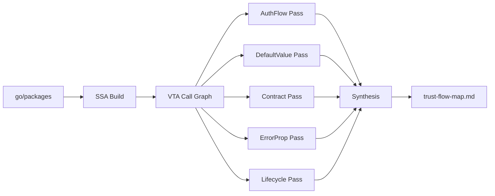

# trust-flow-analyzer

Deterministic cross-file trust flow extraction for Go source code. No LLM calls. Same output every run.

## What it does

Static analysis tools like CodeQL can tell you "data flows from A to B." trust-flow-analyzer tells you **"A assumes B validates the data, but B doesn't."**

It extracts cross-file implicit assumptions that contradict each other, a pattern known in formal verification as [assume-guarantee reasoning](https://en.wikipedia.org/wiki/Assume-guarantee_reasoning).

## The problem

LLM-based code review agents analyze files individually and miss cross-file compositional vulnerabilities. The agent finds the pieces but never synthesizes "the combination of these defaults across 5 files creates a bypass."

For example, in a real kube-auth-proxy review:

- `tokenreview.go`: empty audiences field (noted but dismissed as "documented behavior")
- `provider_default.go`: `len(AllowedGroups) == 0 { return true }` (noted but rated Minor)
- `authz/auth.go`: SubjectAccessReview exists (noted as mitigation)

The agent dismissed the first two because it saw the SAR in the third file. But the SAR is on a **different code path**. The agent confused which mitigation applies to which path because it doesn't maintain a structured map of parallel trust flows.

## Five analysis passes

| Pass | What it extracts |
|------|-----------------|
| **AuthFlow** | Traces credential arrival to access decision. Groups into distinct paths. Determines posture (PERMISSIVE vs RESTRICTIVE). |
| **DefaultValue** | Finds what empty/nil/zero means at each config level. Cross-references with K8s platform semantics. |
| **Contract** | For functions returning errors, checks if all callers handle the error. |
| **ErrorProp** | Traces error values from creation to handling. Flags dropped errors. |
| **Lifecycle** | Traces K8s resource creation, ownership, and cleanup. Flags orphanable resources. |

After all passes run, **contradiction synthesis** detects cross-file assumption violations.

## Quick start

```bash
go install github.com/ugiordan/trust-flow-analyzer/cmd/trust-flow-analyzer@latest
trust-flow-analyzer analyze /path/to/go/project
```

## How it works

Uses `golang.org/x/tools/go/packages` for type-checked loading, SSA for interprocedural analysis, and VTA for precise call graph construction. Same stack as [govulncheck](https://pkg.go.dev/golang.org/x/vuln/cmd/govulncheck).



## Integration

- **adversarial-reviewing**: produces `trust-flow-map.md` consumed via `--context trust-flow=path/to/map.md`
- **architecture-analyzer**: optionally takes arch-analyzer output for component boundary scoping
- **code-claim-verifier**: provides ground truth for CCV to check agent claims against
